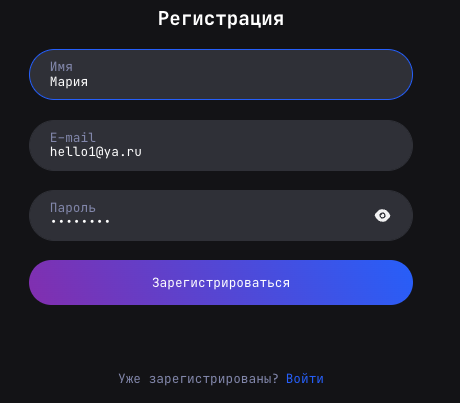
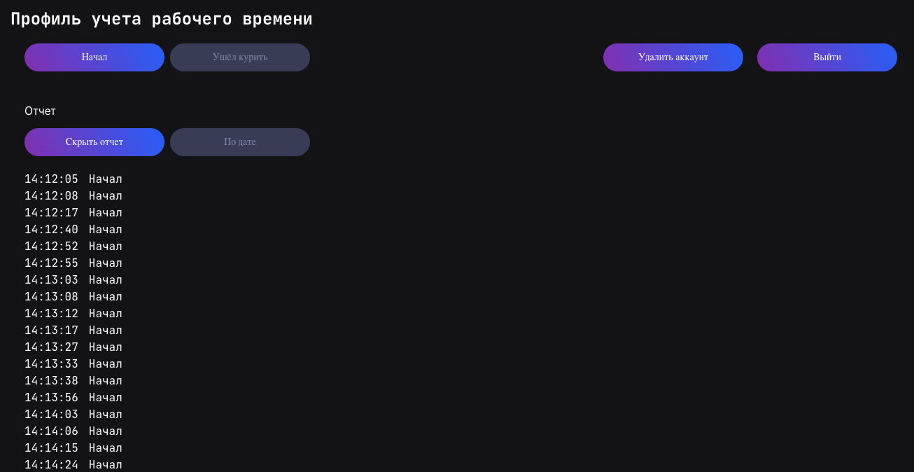
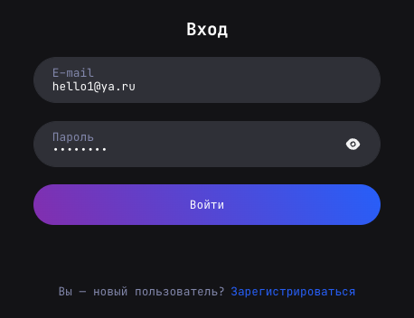

## Тестовое задание компании Powwwer



## Обзор
**Система учёта времени сотрудников компании**

Статическая верстка веб-страница

Функционал:
 * Redux
 
   - Получение списка действий. Используется в компоненте profile-report;
   - Добавление действий пользователя в компоненте profile-header;




* React-Router
   - Регистрация
   - Авторизация
	- Профиль
	- Удаление пользователя
   - Выход из системы
   - Куки
   - Защищённые маршруты в приложении

___
## Использованные технологии
**Client**
* HTML
* CSS
* react - JSX (модульный подход с использованием import, export)
* hooks
* react-datepicker
* redux
* redux-persist
* react router v5.2.1
* dayjs
* Cypress
* Jest

**Server**
* express
* dotenv
* sequelize
* @sequelize/core
* cookie-parser
* bcrypt
* jsonwebtoken
* swagger-ui-express
* nodemon
___



___
## Локальная установка и запуск server
```
Клонировать репозиторий
  git clone git@github.com:Volkova-fe/powwwer_test.git

Войти из корня проекта через консоль
  cd server

Установить зависимости
  npm install

Старт сервера
  npm run dev

Доументацию по API можно посмотреть при запущенном сервере http://localhost:5002/doc/
```
___
## Локальная установка и запуск client
```
Войти из корня проекта через консоль
  cd client

Установить зависимости
  npm install

Старт сервера
  npm start
```

___
## Запуск Unit тестов jest
```
Старт сервера
  npm test
```
___
## Запуск e2e тестов cypress
```
Старт сервера
   npm run cypress:open
```
___
## В случае ошибки store Redux необходимо установить отладчик

* [ссылка на расширение для Chrome](https://chrome.google.com/webstore/detail/redux-devtools/lmhkpmbekcpmknklioeibfkpmmfibljd)
* [ссылка на расширение для Firefox](https://addons.mozilla.org/en-US/firefox/addon/reduxdevtools/)
